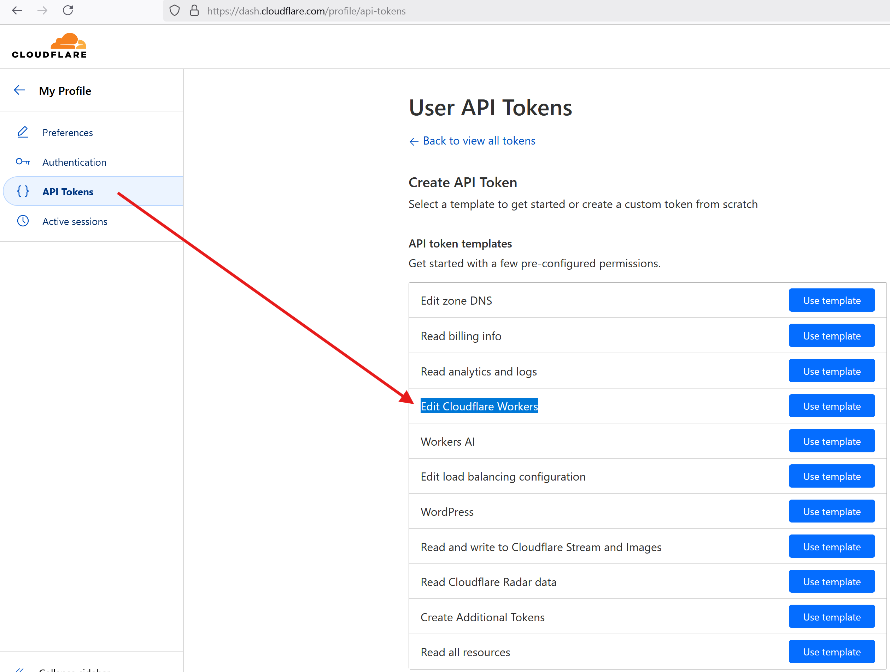
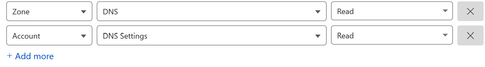
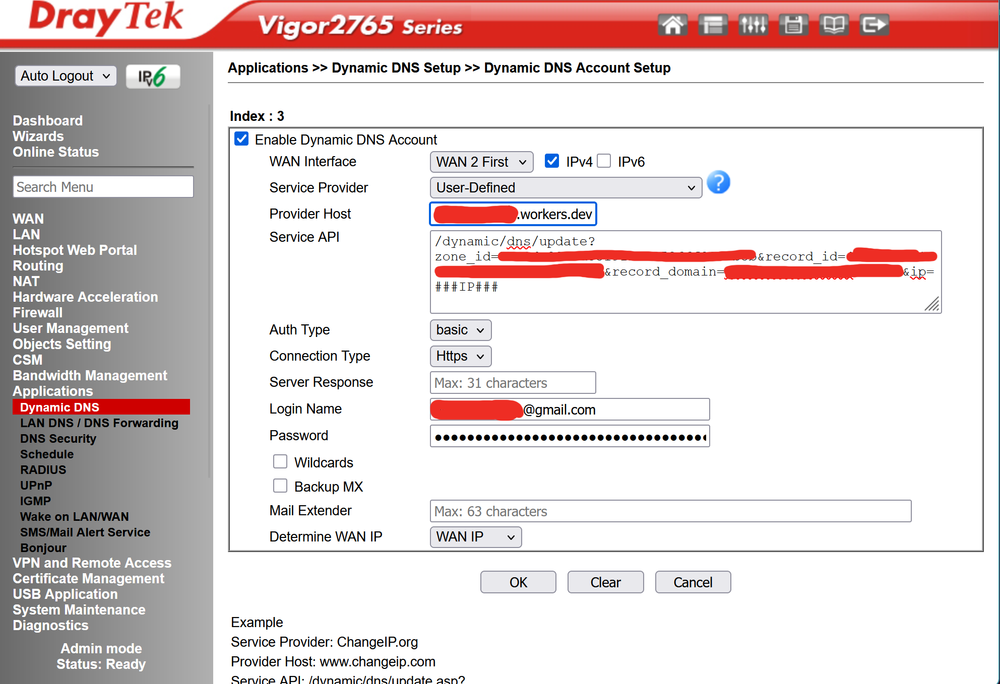

# draytek-ddns-cloudflare
Update Cloudflare DNS records with a serverless Cloudflare worker which can be used by Draytek Modems, and possibly other modems that allow custom Dynamic DNS setups


# Setup

1. Install terraform https://developer.hashicorp.com/terraform/install

2. Login to Cloudflare, and generate an API the Edit Cloudflare Workers template


3. Add two additional Permissions for terraform data resources to extract DNS IDs


4. Create a terraform.tfvars in the terraform folder to pass your Cloudflare values

example `terraform/terraform.tfvars` file contents

```hcl
# https://dash.cloudflare.com/profile
email       = "cloudflare_login_email@email.com"

# https://dash.cloudflare.com/profile/api-tokens
api_token   = "token_value_generated_from_Edit Cloudflare Workers_template"

https://dash.cloudflare.com/<your_account_id>/home/domains
account_id  = "put_your_account_id_here"

# https://dash.cloudflare.com/<your_account_id>/home/domains
zone        = "example.com"

# https://dash.cloudflare.com/<your_account_id>/<zone>>/dns/records
zone_record = "*"     # Any existing A record you wish to keep updated
```

5. Run terraform to create the worker in the account

```bash
# cd terraform
# terraform init
# terraform plan
# terraform apply
```

You can ignore this particular warning which relates to the activation of the cloudflare_workers_script_subdomain resource
```
│ Warning: Resource Destruction Considerations
```

It refers to the Domains & Routes Enabled/Disabled setting for the worker

6. The output value will be the Service API contents in Draytek (Without quotes)

7. Draytek Dynamic DNS setup
* `WAN Interface`    : The Interface that connects to the internet, The Draytek Dashboard will show the connected WAN interface in Green normally
* `Service Provider` : User-Defined
* `Provider Host`    : Domains & Routes workers.dev address, probably ddns.your-name.workers.dev unless you customised it
* `Service API`      : The output from terraform
* `Auth Type`        : Basic
* `Connection Type`  : Https
* `Login Name`       : Cloudflare email login
* `Password`         : Cloudflare Global API Key (Admin Permissions), Or you can create an API key with the correct write permissions to the Zone you are updating

